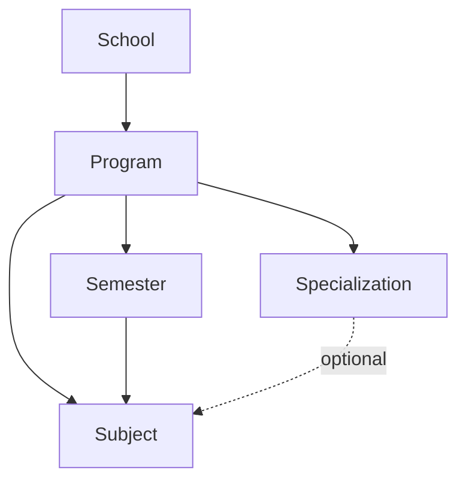

# Academic Modules

## Hierarchy



## Schools

Files:

- Route: `backend/src/routes/school.routes.js`
- Controller: `backend/src/controllers/acadmicgroups/school.controller.js`
- Model: `backend/src/models/school.model.js`

Fields: `name`, `slug`, `description`, `logo`, `banner`, `status`, `createdBy`, `updatedBy`.

Indexes:

- Unique `name`
- Unique `slug`

Endpoints:

- `GET /api/schools`
- `GET /api/schools/:id`
- `POST /api/schools`
- `PUT /api/schools/:id`
- `DELETE /api/schools/:id`

## Programs

Files:

- Route: `backend/src/routes/program.routes.js`
- Controller: `backend/src/controllers/acadmicgroups/program.controller.js`
- Model: `backend/src/models/program.model.js`
- Semester service: `backend/src/services/academic/semesterGeneration.service.js`

Fields: `name`, `schoolId`, `description`, `status`, `duration`, `degreeType`, audit fields.

Business rules:

- `Program.duration` is in years.
- Creating a program generates `duration * 2` program-level semesters.
- Increasing duration generates missing semesters only.
- Decreasing duration is blocked if higher semesters contain subjects, users, or notifications.
- Program delete is blocked if dependent semesters, subjects, users, notifications, or specializations exist.

## Semesters

Files:

- Controller: `backend/src/controllers/acadmicgroups/semester.controller.js`
- Model: `backend/src/models/semester.model.js`
- Creation route currently exists through legacy `creation.routes.js` if mounted externally; primary backend flow is automatic generation from program creation.

Business rules:

- Semester belongs to `Program`.
- `specializationId` remains in schema for compatibility but new code writes it as `null`.
- Unique index: `programId + specializationId + semesterNumber`.

## Specializations

Files:

- Route: `backend/src/routes/specialization.routes.js`
- Controller: `backend/src/controllers/acadmicgroups/specialization.controller.js`
- Model: `backend/src/models/specelization.model.js`
- Compatibility alias: `backend/src/models/specialization.model.js`

Business rules:

- Specialization belongs to one program.
- Creating specialization does not generate semesters.
- Delete is blocked if subjects, users, or notifications depend on it.

## Subjects

Files:

- Route: `backend/src/routes/subject.routes.js`
- Create controller: `backend/src/controllers/acadmicgroups/subject.controller.js`
- List controller: `backend/src/controllers/get/getSubject/getSubject.controller.js`
- Model: `backend/src/models/subject.model.js`

Business rules:

- Subject requires `schoolId`, `programId`, `semesterId`.
- `specializationId` is optional.
- Common subjects use `specializationId: null`.
- Specialization subjects use `specializationId`.
- Semester must belong to the selected program.
- If specialization is provided, specialization must belong to selected program.
- Student subjects are fetched dynamically by `programId + semesterId + specializationId`, returning common plus specialization subjects.

## Subject Fetching

Use:

```http
GET /api/subjects?programId=<programId>&semesterId=<semesterId>&specializationId=<optionalSpecializationId>
```

If `specializationId` is provided, backend returns:

- common subjects where `specializationId: null`
- specialization-specific subjects where `specializationId` matches

