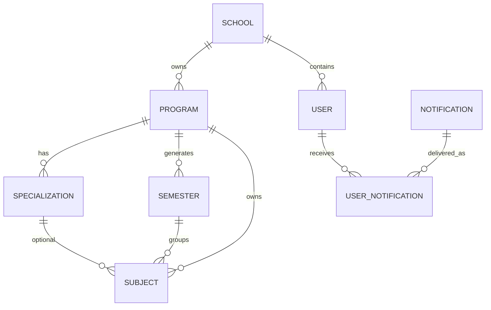
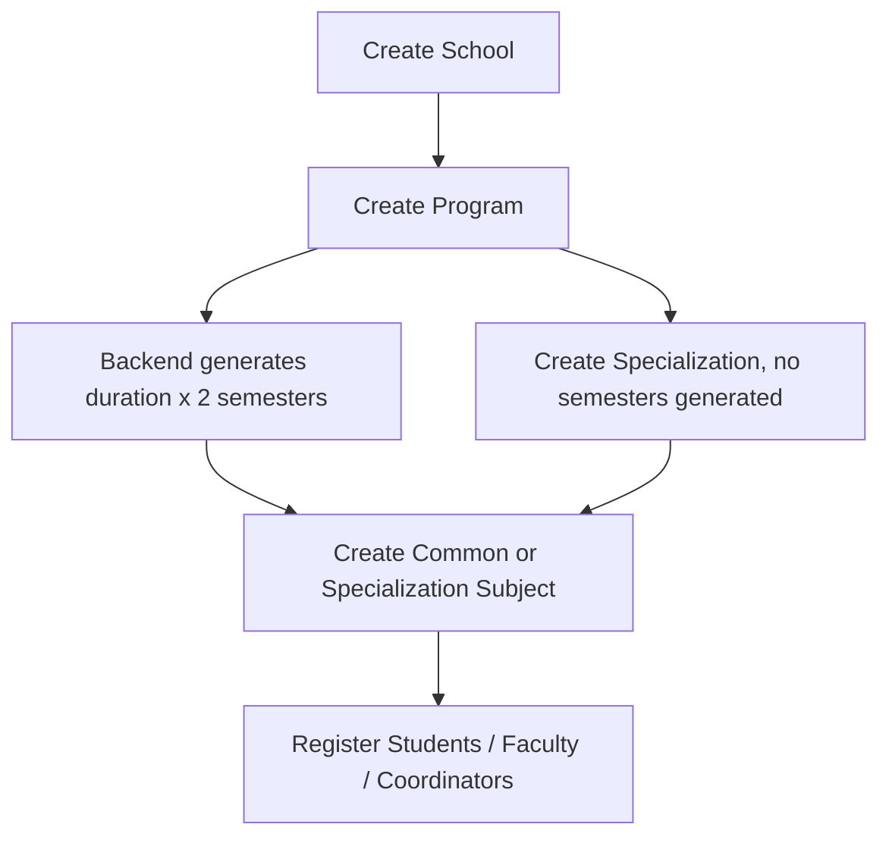

# Architecture

## Stack

| Layer | Technology |
|---|---|
| Runtime | Node.js |
| HTTP | Express 5 |
| Database | MongoDB with Mongoose |
| Auth | JWT in HTTP-only cookie |
| File upload | Multer, ImageKit storage service |
| Email | Nodemailer |
| Validation | Custom `validate.middleware.js` plus service-level validation |
| Audit | Mongoose `AuditLog` model plus audit middleware/manual audit writes |

## High-Level Domain



## Academic Flow



## Important Services

| Service | Purpose |
|---|---|
| `services/auth/register.service.js` | User registration orchestration, transaction, setup email, audit |
| `services/user/validateAcademicAssignment.service.js` | Program/semester/specialization/subject validation for user academic assignments |
| `services/user/permission.service.js` | Role and school-admin creation restrictions |
| `services/user/duplicateUser.service.js` | Payload and database duplicate checks |
| `services/academic/semesterGeneration.service.js` | Program semester generation and program deletion/duration safety checks |
| `services/notification/audience.service.js` | Resolves notification recipients from user filters |
| `services/notification/notificationQuery.service.js` | Notification feed, pagination, filtering, unread count |
| `services/notification/notificationCleanup.service.js` | Scheduled soft-expiry of expired notifications |

## Response Format

Some controllers use direct JSON responses and some use `utils/apiResponse.js`.

Standard helper success:

```json
{
  "success": true,
  "message": "Fetched successfully",
  "data": {},
  "pagination": {}
}
```

Standard helper error:

```json
{
  "success": false,
  "message": "Validation failed",
  "errors": []
}
```

Older controllers may return `{ "message": "..." }` directly. Frontend code should handle both.

