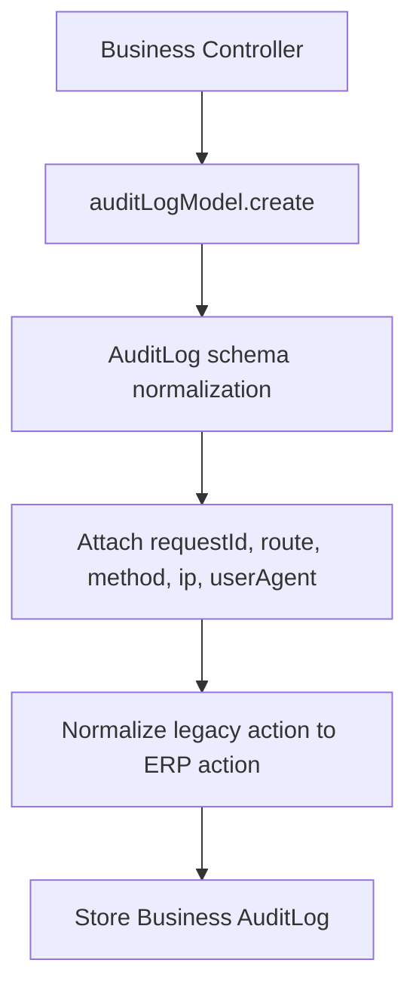
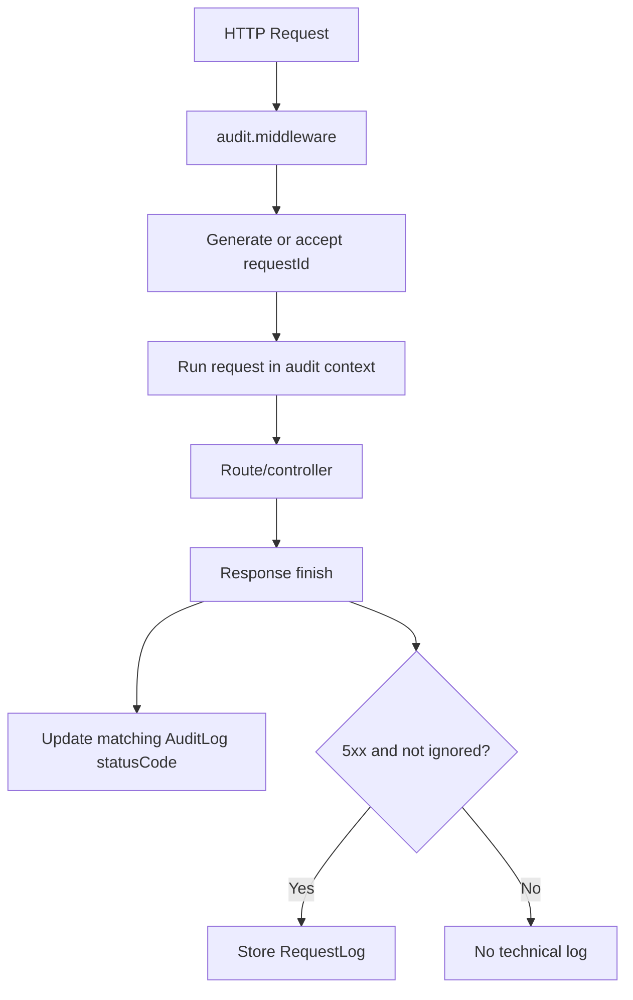

# Audit Logging Redesign Report

## Files Modified

- `backend/src/models/auditlog.model.js`
- `backend/src/middlewares/audit.middleware.js`
- `backend/src/controllers/auth.controller.js`
- `backend/src/controllers/notification/createNotification.controller.js`
- `backend/src/controllers/notification/markNotificationRead.controller.js`
- `backend/src/controllers/notification/deleteNotification.controller.js`
- `backend/src/controllers/notification/pinNotification.controller.js`

## Files Created

- `backend/src/models/requestlog.model.js`
- `backend/src/services/audit/auditContext.service.js`
- `backend/src/services/notification/notificationAudit.service.js`
- `backend/docs/audit-redesign-report.md`

## Files Deleted

- None.

## Old vs New Architecture

Old architecture:

- `audit.middleware.js` wrote `AuditLog` records for completed `GET` requests.
- Dashboard refreshes, notification polling, stats reads, and other technical reads polluted business audit history.
- Generic actions such as `CREATE`, `READ`, `UPDATE`, and `DELETE` could be stored directly.
- Login and other business actions could be duplicated by request-level logging.

New architecture:

- `AuditLog` stores business and security events only.
- Technical request telemetry is separated into `RequestLog`.
- Middleware no longer writes normal request activity into `AuditLog`.
- Existing controller audit calls are centrally normalized into enterprise business actions.
- Request metadata is attached through async request context.
- Unexpected server failures can be recorded in `RequestLog` without polluting business audit history.

## Audit Flow Diagram



## Request Flow Diagram



## Business Events Covered

- Authentication: `LOGIN`, `LOGIN_FAILED`, `LOGOUT`, `PASSWORD_SETUP`
- Authorization/security: `PERMISSION_DENIED`, `UNAUTHORIZED_ACCESS`, `SUSPICIOUS_ACTIVITY`
- User management: `USER_CREATED`, `USER_UPDATED`, `USER_DELETED`, `USER_STATUS_CHANGED`
- Academic: `SCHOOL_CREATED`, `SCHOOL_UPDATED`, `PROGRAM_CREATED`, `PROGRAM_UPDATED`, `PROGRAM_DELETED`, `SPECIALIZATION_CREATED`, `SPECIALIZATION_UPDATED`, `SEMESTER_GENERATED`, `SEMESTER_UPDATED`, `SUBJECT_CREATED`, `SUBJECT_UPDATED`, `SUBJECT_DELETED`
- Assignments: `FACULTY_ASSIGNED`, `FACULTY_REMOVED`, `COORDINATOR_ASSIGNED`, `COORDINATOR_REMOVED`
- Communication: `NOTICE_CREATED`, `NOTICE_UPDATED`, `NOTICE_DELETED`, `NOTICE_PUBLISHED`, `EVENT_CREATED`, `EVENT_UPDATED`, `EVENT_DELETED`, `NOTIFICATION_SENT`, `NOTIFICATION_DELETED`
- System/security categories are supported for future use: `DATABASE_BACKUP`, `DATA_IMPORT`, `DATA_EXPORT`, `ACCOUNT_LOCKED`, `ACCOUNT_UNLOCKED`, `TOKEN_EXPIRED`, `INVALID_TOKEN`

## Events Ignored

The middleware no longer writes normal request traffic to `AuditLog`, including:

- Dashboard reads
- Notification feed reads
- Unread-count reads
- Stats reads
- `OPTIONS`
- `HEAD`
- `304`
- favicon
- health/ping/polling endpoints
- frontend refreshes

Notification read acknowledgements are treated as user interaction state and are not stored as business audit events.

## Performance Improvements

- Eliminates high-volume `GET` audit writes.
- Prevents dashboard/notification polling from filling `AuditLog`.
- Stores only unexpected server failures in `RequestLog`.
- Central action normalization avoids large controller rewrites while preserving existing behavior.

## Security Improvements

- Audit records now include `severity`.
- Audit records now include `requestId`, `route`, `method`, and `statusCode` when available.
- Unauthorized notification creation attempts are explicitly audited.
- Failed notification creation attempts are captured as security-relevant audit events.
- Logout now produces a business audit event.

## Breaking Changes

None expected.

- Routes are unchanged.
- Request bodies are unchanged.
- Response bodies are unchanged.
- Authentication behavior is unchanged.
- Existing controller audit calls continue to work through central normalization.

## Manual Testing Checklist

- Login with valid credentials and confirm one `LOGIN` audit record.
- Login with invalid credentials and confirm one `LOGIN_FAILED` audit record.
- Logout and confirm one `LOGOUT` audit record.
- Create a notification with matching audience and confirm `NOTIFICATION_SENT`.
- Create a notification with no matching active users and confirm an error-severity business audit event.
- Load dashboard repeatedly and confirm no dashboard `GET` records are inserted into `AuditLog`.
- Load notification feed repeatedly and confirm no feed `GET` records are inserted into `AuditLog`.
- Force a 500 response in development and confirm a `RequestLog` record is written.
- Confirm recent activities still read from `AuditLog`.

## Verification Commands

```bash
node -c backend/src/models/auditlog.model.js
node -c backend/src/models/requestlog.model.js
node -c backend/src/middlewares/audit.middleware.js
node -c backend/src/services/audit/auditContext.service.js
node -c backend/src/services/notification/notificationAudit.service.js
node -c backend/src/controllers/auth.controller.js
node -c backend/src/controllers/notification/createNotification.controller.js
node -c backend/src/controllers/notification/markNotificationRead.controller.js
node -c backend/src/controllers/notification/deleteNotification.controller.js
node -c backend/src/controllers/notification/pinNotification.controller.js
```
