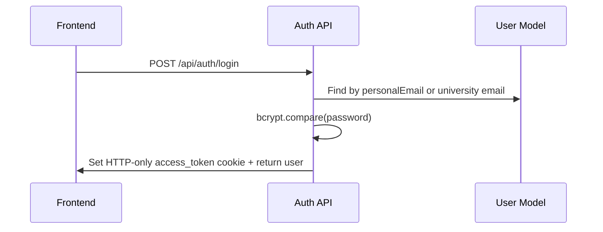

# Authentication

## Files

| Concern | File |
|---|---|
| Routes | `backend/src/routes/auth.routes.js` |
| Controller | `backend/src/controllers/auth.controller.js` |
| Register service | `backend/src/services/auth/register.service.js` |
| Auth middleware | `backend/src/middlewares/auth.middleware.js` |
| User model | `backend/src/models/user.model.js` |

## Auth Endpoints

| Method | Endpoint | Auth | Purpose |
|---|---|---|---|
| `POST` | `/api/auth/login` | No | Login and set `access_token` cookie |
| `POST` | `/api/auth/logout` | No | Clear `access_token` cookie |
| `GET` | `/api/auth/me` | Yes | Return current authenticated user |
| `POST` | `/api/auth/setup-password` | No | Complete first-time password setup |
| `POST` | `/api/auth/register` | Yes | Create one or more users |

## Login Flow



## Cookie

`auth.controller.js` sets:

```js
res.cookie("access_token", token, {
  httpOnly: true,
  secure: process.env.NODE_ENV === "production",
  sameSite: "strict",
  maxAge: 7 * 24 * 60 * 60 * 1000
});
```

Frontend must use Axios/fetch with credentials.

## Auth Middleware

`chkUser` reads:

- `req.cookies.access_token`
- or `Authorization: Bearer <token>`

It verifies JWT with `JWT_SECRET`, loads the user from MongoDB, attaches:

- `req.user`
- `req.user._id`
- `req.authUser`

Missing/invalid token returns `401`.

## Password Setup

New users get a setup token by email. `POST /api/auth/setup-password` hashes the token, finds a valid user token, stores bcrypt password, activates the user, and clears token fields.

## Roles

Valid roles:

- `superAdmin`
- `schoolAdmin`
- `faculty`
- `coordinator`
- `student`
- `examCell`

Coordinator must also have `faculty`.

