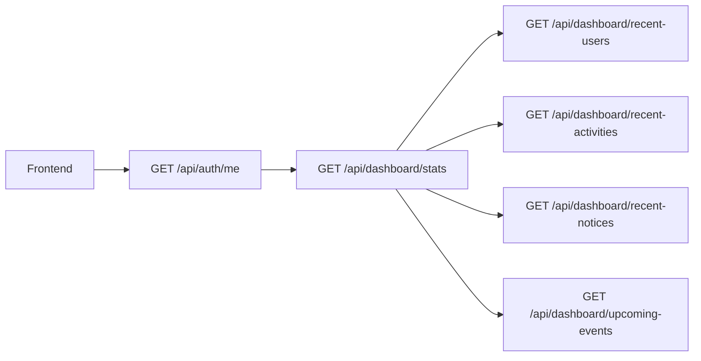

# Dashboard

## Files

- Route: `backend/src/routes/dashboard.routes.js`
- Controller: `backend/src/controllers/dashboard.controller.js`

## Endpoints

| Method | Endpoint | Purpose |
|---|---|---|
| `GET` | `/api/dashboard/stats` | Counts for users, schools, programs, subjects, notices, events |
| `GET` | `/api/dashboard/recent-users` | Recently created users |
| `GET` | `/api/dashboard/recent-activities` | Recent audit activities |
| `GET` | `/api/dashboard/recent-notices` | Recent notices |
| `GET` | `/api/dashboard/upcoming-events` | Upcoming events |

All dashboard routes require authentication.

## Dashboard Flow

