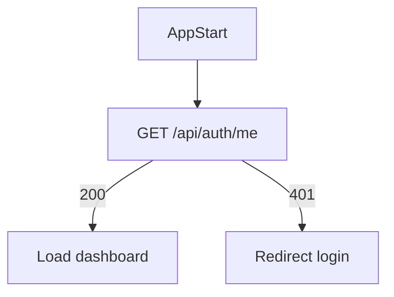
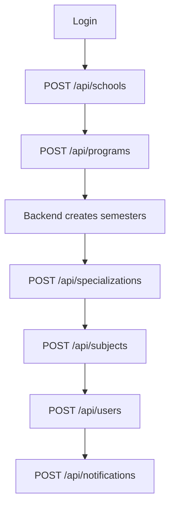

# Frontend Integration Guide

## Axios Setup

```js
import axios from "axios";

export const api = axios.create({
  baseURL: import.meta.env.VITE_API_URL,
  withCredentials: true,
});
```

## Recommended Startup Flow



## Admin Setup Flow



## Dependent Dropdowns

1. Load schools: `GET /api/schools`
2. When school selected, load programs: `GET /api/programs?schoolId=<schoolId>`
3. When program selected, load specializations: `GET /api/specializations?programId=<programId>`
4. Load semesters from generated program semesters. There is no dedicated REST semester route mounted in `app.js`; current consumers receive semester IDs from users/subjects or use manual legacy creation flow if mounted separately.
5. Load subjects: `GET /api/subjects?programId=<programId>&semesterId=<semesterId>&specializationId=<specializationId>`

## Authentication Handling

- After login, backend sets cookie.
- On refresh, call `/api/auth/me`.
- On `401`, clear frontend auth state and redirect to login.
- Do not store JWT from response unless legacy frontend code requires it; cookie is authoritative.

## Pagination

List endpoints generally support:

- `page`
- `limit`
- `search`
- `sortBy`
- `order`

Use pagination metadata when present.

## Common Frontend Errors

| Status | Meaning |
|---|---|
| `400` | Invalid input or invalid ObjectId |
| `401` | Missing/invalid auth cookie |
| `403` | Role or school restriction failed |
| `404` | Document not found |
| `409` | Duplicate or protected delete/update |
| `422` | Existing user conflict |
| `500` | Server-side failure |

