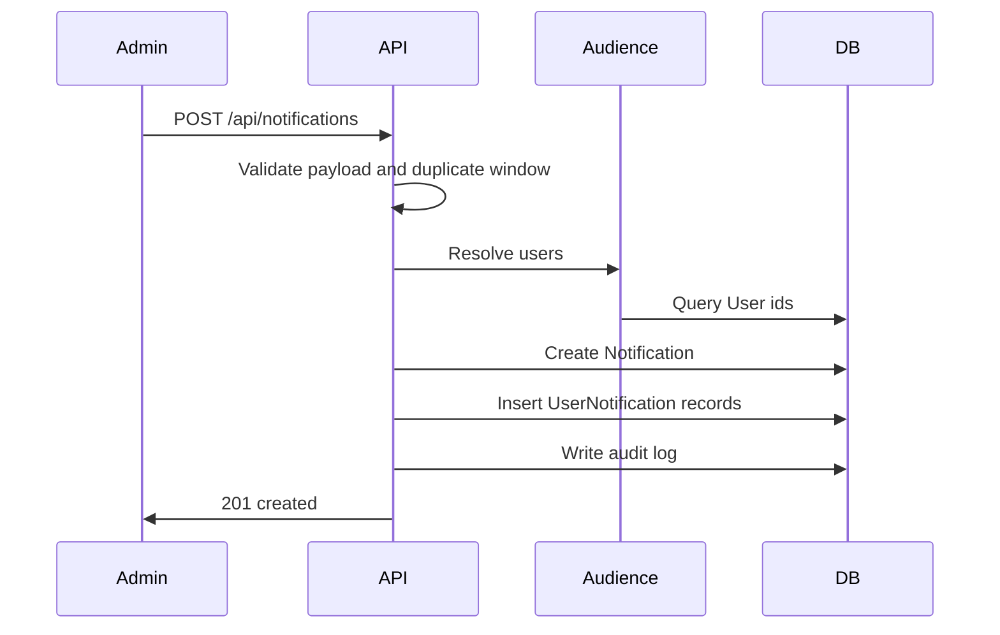

# Notifications

## Files

| Concern | File |
|---|---|
| Routes | `backend/src/routes/notification.routes.js` |
| Models | `backend/src/models/notificaton.Model.js`, `backend/src/models/userNotificaton.model.js` |
| Create | `backend/src/controllers/notification/createNotification.controller.js` |
| Feed | `backend/src/controllers/notification/getNotifications.controller.js` |
| Read | `backend/src/controllers/notification/markNotificationRead.controller.js` |
| Delete/restore | `backend/src/controllers/notification/deleteNotification.controller.js` |
| Pin/unpin | `backend/src/controllers/notification/pinNotification.controller.js` |
| Analytics | `backend/src/controllers/notification/notificationAnalytics.controller.js` |
| Audience | `backend/src/services/notification/audience.service.js` |

## Capabilities

- Individual notifications
- Role-based notifications
- School/program/specialization/semester targeting
- Global notifications
- Per-user read state
- Soft delete and restore
- Pin/unpin with limit
- Duplicate prevention
- Expiry cleanup
- Analytics caching

## Endpoints

| Method | Endpoint | Purpose |
|---|---|---|
| `GET` | `/api/notifications` | Current user notification feed |
| `GET` | `/api/notifications/unread-count` | Current user unread count |
| `GET` | `/api/notifications/analytics` | Admin analytics |
| `POST` | `/api/notifications` | Create and deliver notification |
| `PATCH` | `/api/notifications/read-many` | Mark selected notifications read |
| `PATCH` | `/api/notifications/read-all` | Mark all current-user notifications read |
| `PATCH` | `/api/notifications/:id/read` | Mark one notification read |
| `PATCH` | `/api/notifications/:id/pin` | Pin notification |
| `PATCH` | `/api/notifications/:id/unpin` | Unpin notification |
| `DELETE` | `/api/notifications/:id` | Soft-delete current-user notification |
| `PATCH` | `/api/notifications/:id/restore` | Restore current-user notification |

## Audience Payload

```json
{
  "allUsers": false,
  "userIds": [],
  "roles": ["student"],
  "schoolIds": [],
  "programIds": [],
  "specializationIds": [],
  "semesterIds": [],
  "includeUsersWithoutSpecialization": true,
  "excludeUserIds": [],
  "excludeRoles": []
}
```

Audience rules:

- Different fields are combined with AND.
- Values within the same field are OR.
- Inactive users are ignored.
- Duplicate recipients are removed by Mongo query result uniqueness.
- Program, specialization, and semester filters match against user academic assignments.

## Create Notification Example

```json
{
  "title": "Semester Exam Schedule",
  "message": "The semester exam schedule has been published.",
  "type": "exam",
  "priority": "high",
  "audience": {
    "roles": ["student"],
    "programIds": ["64f000000000000000000002"],
    "semesterIds": ["64f000000000000000000003"]
  },
  "reference": {
    "model": "Program",
    "id": "64f000000000000000000002"
  }
}
```

## Notification Flow



